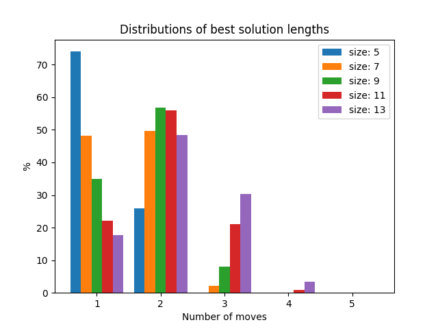

This folder contains investigations of the game's complexity, as well as benchmarks for the implemented algorithms and their results.

# How to run
All scripts require the path to the shared library libexhsearch/libminimax. See instructions in main readme for compilation.
Running the scripts requires the dependencies of `requirements.txt` to be installed in the virtual env.
Due to the dependencies to the labyrinth module, it is also required to add the respective path to the PYTHONPATH, e.g.

    export PYTHONPATH=$PYTHONPATH:path/to/labyrinth/backend/:path/to/labyrinth/experiments/

The subfolders contain further information on how to run the experiments.