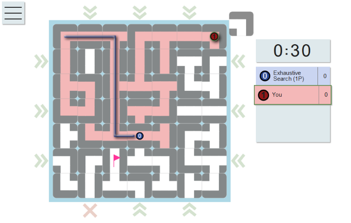

# Labyrinth

Play it at [maze-solver.com](https://maze-solver.com).

Labyrinth is a family board game. This project aims to recreate the game as a online multiplayer game, develop understanding of the game's complexity and implement practical search algorithms. There is one major difference to the [original game](https://www.ravensburger.com/spielanleitungen/ecm/Spielanleitungen/Labyrinth_26448_GB.pdf): all players have the same objective.

# Run locally

    docker compose up

Open `localhost` in your browser. Edge and IE are not supported.

# Bots
Bots are implemented in C++. They are not required to run the game. They are either called by the backend as shared libraries or compiled to WebAssembly to be used by the web-client. See [readme in algolibs](algolibs/readme.md) for build steps.

## Experiments
The folder `experiments` contains analysis and benchmarks for the algorithm implementations.
See [readme in experiments](experiments/readme.md) for further instructions.
